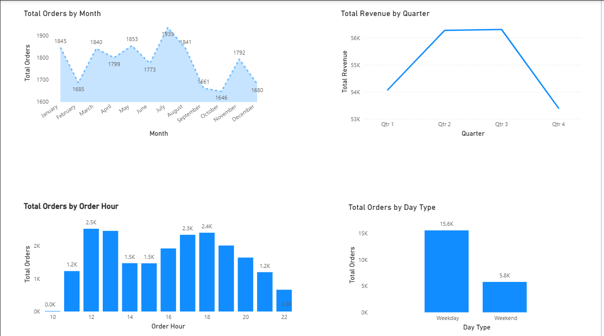

# 🍕 Pizza Sales Power BI Dashboard

This project analyzes pizza sales performance using **Power BI**.
It focuses on revenue, order volume, pizza size trends, and time-based insights.

---

## 📊 Dashboard Overview

### 🔹 Overview Page

---

### 🔹 Time Analysis Page

---

## 📁 Files in this Repository
- `pizza sales dashboard.pbix` → Power BI dashboard file  
- `screenshots/` → Dashboard screenshots  
- `README.md` → Project documentation  

---

## 🔧 Tools Used
- Power BI
- DAX
- Data Modeling
- Data Visualization

---

## 📌 Key Insights
- **Classic pizzas** generate the highest revenue  
- **Large (L)** size pizzas are the most popular  
- **Weekdays** have higher order volume than weekends  
- Peak order hours are in the **afternoon & evening**

---

## 👤 Author
**Ayush Bhardwaj**

